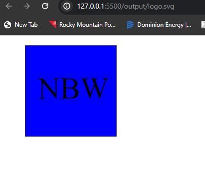

# SVG LogoMotion

# Description
nodejs app that makes a vector image of 3 letters over a choice of 3 simple shapes, with text and background color options. Makes a quick placemarker logo. 

# Installation
Needs Node.js, Jest, and Inquierer, run npm install to get those libs. 

# Usage
run - Node index.js

Example

https://drive.google.com/file/d/1hICv9OiV-AMdBrQI-U5ktMgebYUVjDKY/view
